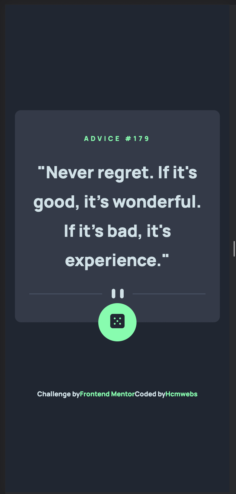
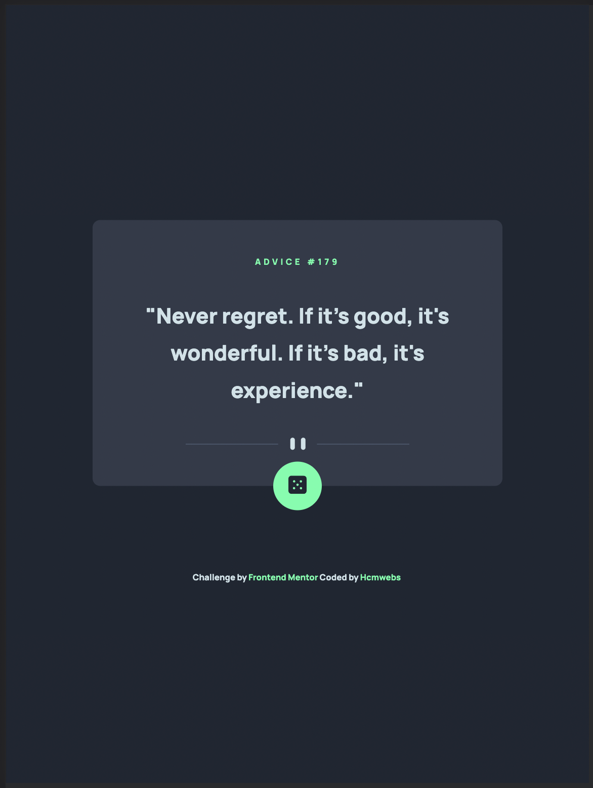
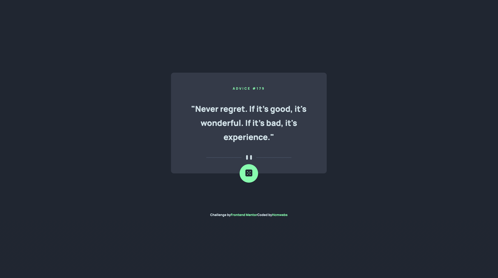

# Frontend Mentor - Advice generator app solution

This is a solution to the [Advice generator app challenge on Frontend Mentor](https://www.frontendmentor.io/challenges/advice-generator-app-QdUG-13db). Frontend Mentor challenges help you improve your coding skills by building realistic projects.

## Table of contents

- [Overview](#overview)
  - [The challenge](#the-challenge)
  - [Screenshot](#screenshot)
  - [Links](#links)
- [My process](#my-process)
  - [Built with](#built-with)
  - [What I learned](#what-i-learned)
  - [Continued development](#continued-development)
  - [Useful resources](#useful-resources)
- [Author](#author)
- [Acknowledgments](#acknowledgments)

## Overview

### The challenge

Users should be able to:

- View the optimal layout for the app depending on their device's screen size
- See hover states for all interactive elements on the page
- Generate a new piece of advice by clicking the dice icon

### Screenshot

### Links

- [Solution](https://your-solution-url.com)
- [Live site](https://your-live-site-url.com)

## My process

### Built with

- Semantic HTML5 markup
- CSS custom properties
- CSS Grid
- Mobile-first workflow
- [Sass](https://sass-lang.com/dart-sass) - For styles.
- [Sass - 7 in 1 pattern](https://sass-guidelin.es/#architecture) - For sass folders organization.
- [React](https://reactjs.org/) - JS library
- [Axios API](https://axios-http.com/)

### What I learned

This week I learnt [Axios API](https://axios-http.com/) which worked quite well for me with this project.
To see how you can add code snippets, see below:

### Continued development

My level in react is still very basic but I am enjoying every project that I am learning with. I am still not in my comfort-zone on this hence I will continue working on it.

### Useful resources

- [Google](https://www.google.com)

- [Stackoverflow](https://stackoverflow.com/)- Best place to find all the answers to all the developers' questions about

- [React tutorial and Projects Course ](https://www.udemy.com/course/react-tutorial-and-projects-course/) - This amazing course is in Udemy. It is created and taught by none other but the one and only sir [@john-smilga](https://github.com/john-smilga). He has laid out the course from basics to advance. All the lectures have projects for one to practice.

## Author

- Website - [hcmwebs](https://www.hcmwebs.com)
- Frontend Mentor - [@hcmwebs](https://www.frontendmentor.io/profile/hcmwebs)
- Twitter - [@hcmwebs](https://www.twitter.com/hcmwebs)

## Acknowledgments

- [Frontend mentor](https://www.frontendmentor.io) - Thanks for creating such an amazing platform where each challenge is a learning opportunity.

- [@john-smilga](https://github.com/john-smilga) - Special thank to you for regularly creating content that is so education.
